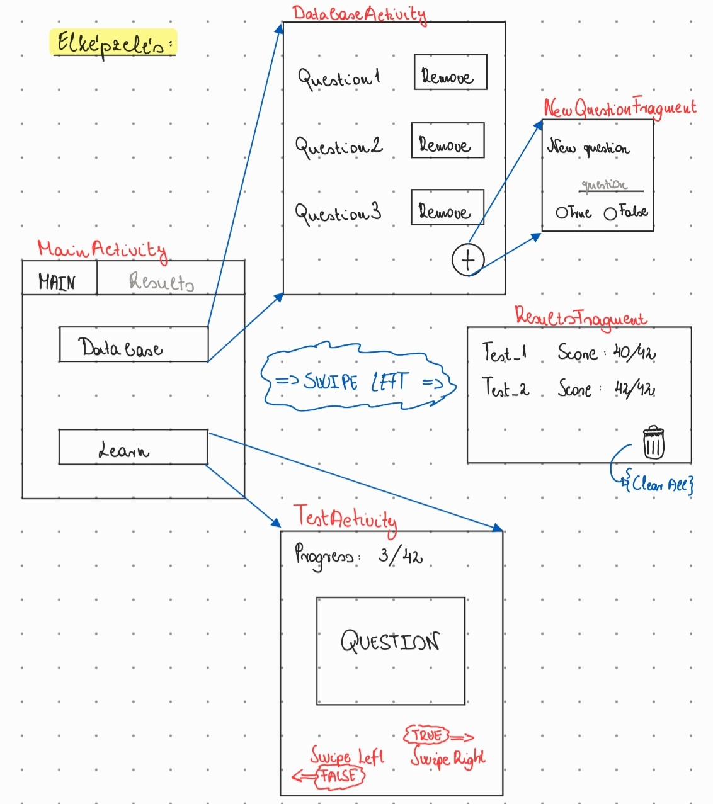

# Házi feladat specifikáció

## Mobil- és webes szoftverek
### 2022.10.22.
### QuizMaker
### Göndöcs Martin
### martin.gondocs@gmail.com 

## Bemutatás

Az alkalmazás egy tanulási módszert valósít meg, vagyis egy összeállított kérdésbankból ellenőrízhetjük tudásunkat. Az ötletet a Quizlet Flashcard nevű játéka szülte, mellyel tanulók könnyen átismételhetik a tananyagot.

## Főbb funkciók

Az alkalmazásban lehetőség van egy kérdésbank összeállítására. Itt lehetőség van kérdések felvételére, tárolására, törlésére. Új kérdés hozzáadásakor magát a kérdést kell megadni, és a hozzá tartozó választ. Egy kérdéshez Igaz vagy Hamis érték társítható, attól függően természetesen, hogy melyik a kérdéshez tartozó helyes válasz.

Ezt követően az alkalmazással elindíthatjuk a tanulási folyamatot. Ekkor egy új teszt jön létre, melyben véletlenszerű sorrendben érkeznek a kérdések az adatbázisunkból (kérdésbankból). A kérdés megválaszolásához jobbra vagy balra kell húznunk a kártyát - ezen kártyán szerepel a feltett kérdés. Előbbi mozdulattal igaznak, míg utóbbival hamisnak állítjuk a kérdést.

Miután az összes kérdés lement, a teszt elmentődik. Ezt követően van lehetőségünk egy új teszt kitöltésére, avagy az eredményeink megtekintésére. Minden teszt eredményét tároljuk, míg azokat valaki ki nem szeretné törli.

## Választott technológiák:

- Perzisztens adattárolás
- fragmentek
- RecyclerView
- animáció

